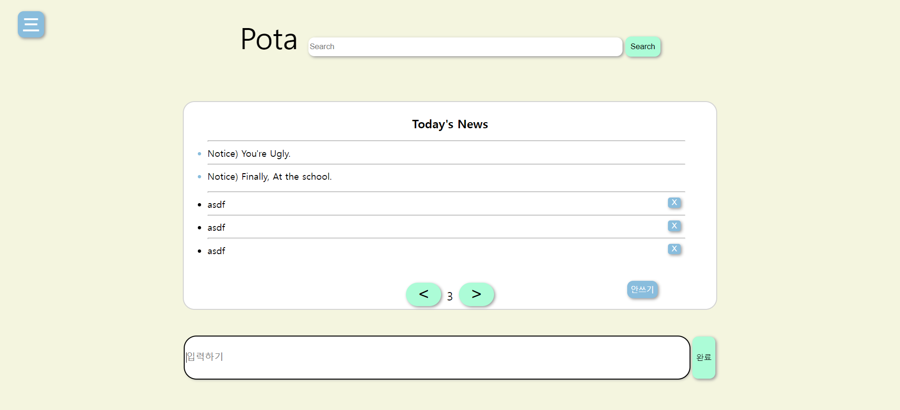
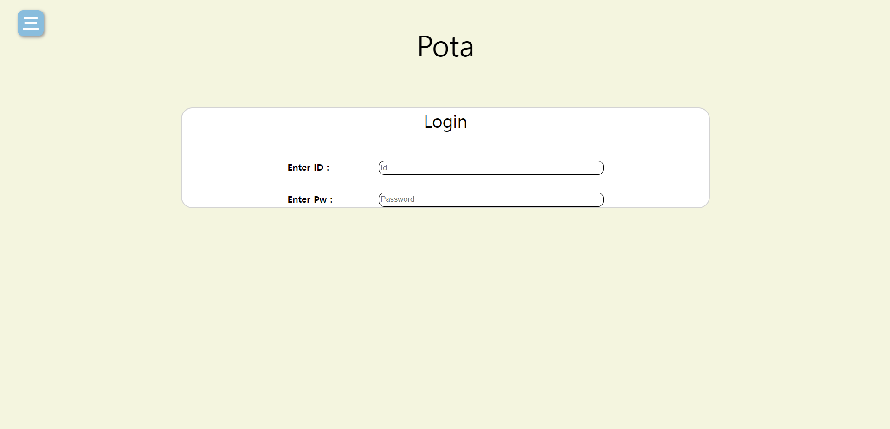

# 개요

한번 각잡고 만들어 보는 개인프로젝트 
무려 직접 로그인하여 글을 쓰고 지우고 검색하고 글을 나눠서 볼 수 있게 만들고 있어요! 
클라이언트 화면 :

로그인 화면 :

[개발중인 화면입니다].

# to-dos

✔사이드를 다른 곳에서도 사용가능하도록 분리하여 다시 병합하기(~~iframe 활용해보기~~, 자바스크립트로 새로 생성하기) 
✔로그인 창 만들기 
✔검색창과 일시적으로 구글 검색창과 연결하여 작동이 되게 하기(변동가능) 
✔로컬스토리지와 연동하여 글을 쓸 수있는 기능을 제작하기 
검색창 클릭시 너비가 넓어지는 애니메이션 구현하기 
🔨이후 검색창으로 로컬스토리지에 작성된 글을 찾을 수 있도록 만들기(현재는 li중 띄우는 거임) 
글을 공지 포함 15개 단위로 쪼개어 한 화면에 나오도록 만들기 
글 페이지를 넘길 수 있는 기능을 구현하기 
로그인 기능을 구현하여 자신이 쓴 글을 알아보고, 지울 수 있도록 하기 
✔글삭제할 수 있는 기능 구현하기 
✔가장 최근 작성된 글을 최상단에 띄우기 

# Feedbacks

아는 형님: 
클론코딩보단 그냥 사이트 하나 만지작거리는거같은데 
이쪽으로 생각 있으면 

1. 다양한 사이트 접속하면서 견문 넓혀라 
2. input tag로 넣은것들 디자인 커스텀이라던지 
3. 버튼 외곽 선 빼버리고 그림자만 넣는다던지 
4. radius를 통해서 모던한 디자인을 한다던지 
5. 코드는 못보는 상황인데 메뉴 표시 저거는 보통 svg로 넣어서 처리하는편인데 
   생긴걸로 봐서 선 몇개 넣은건가 
   그리고 모바일에서 저렇게 요소들 겹치는거 보면 앱솔루트나 릴레이티브일텐데 
6. 그리드나 플렉스, 블럭 이용해서 템플릿 구성하는 법 익히면 좋을거같고 
7. 코드 보는 입장에선 차라리 header 같은 시멘틱 태그 이용해서 구성하는게 더 좋을 것 같다. 

아는 형님2: 
그 뭐냐 script tag는 밑으로 빼서 렌더링우선으로 하는게 맞긴한데  

1. css 불러오는 link태그는 헤더에 넣는게 ux적으로 더 좋고  
2. 디자인은 개발자 연결해주는 그런 정보들은 중요하지 않으면서도 있어야되는거니까  
   footer 느낌으로 넣거나 아니면 좀 더 작게 해도 될거같은데  
3. id password 입력칸 보면 placeholder가 너무 왼쪽으로 치우쳐져있는데  
   좀만 더 여유 두면 좋을거같고  
4. div#end가 div#mainside 안에 속하는데 이유가 있을까  
   nav 바로 밑으로 넣는편이 심미적으로 좋을거같다는 의견인데  
   그 코드상으로 바로 밑줄 말고  
   뎁스상으로  
5. 사실 #mainside 영역보면 #sideBar의 main content 적인 느낌이 강하지  
   mainSide라고 보기엔 좀 약하고 그래서 의견 줬던거야  
   차라리 #sideBar의 #end인편이 낫다?라는거지  
   iframe 태그를 사용해서 분리해보셈  
6. 정확히는 분리가 아니긴한데 비슷할거야  
7. 애초에 html 자체가 하나의 페이지여서 보통은 라우팅작업을 하는거고  
   컴포넌트 작업이랑  
8. js로 innerHTML인가 그런식으로 작업해  
